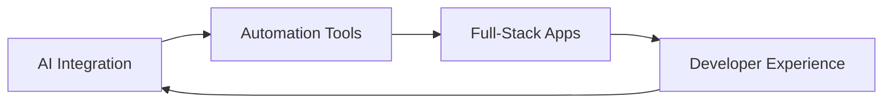

# Hi there, I'm Vineet Kumar (Void) 👋

<div align="center">
  
</div>

<p align="center">
  
  
</p>

---

## 🚀 About Me

> **"I prefer building over talking – creating tools that actually solve problems."**

I'm a full-stack developer passionate about leveraging AI and automation to build meaningful solutions. My focus is on creating efficient, user-friendly tools that save time and enhance productivity.

```yaml
Current Focus: AI-powered automation & full-stack development
Location: Usually behind a screen
Philosophy: Simple solutions for complex problems
```

### 🎯 What I Do
- 🔧 **Full-Stack Development** – Comfortable across frontend and backend technologies
- 🤖 **AI Integration** – Working with GPT, Claude, Gemini, and modern AI tools
- ⚡ **Automation Solutions** – Building tools that eliminate repetitive tasks
- 🌐 **Web Technologies** – APIs, scraping, extensions, and desktop applications

---

## 🛠️ Tech Stack

<div align="center">

### Languages & Frameworks


### Tools & Technologies


### AI & Automation


</div>

---

## 🎯 Featured Projects

### 🎬 SplitKit – Video Auto-Splitter
**Desktop Application | Python + PyQt6**

 A smart desktop tool that auto-splits long videos — optimized for speed and quality.

**Key Features:**
- ⚡ **Dual Processing Modes** – Fast Copy (lossless) & Re-encode options
- 🎛️ **Advanced Controls** – Custom duration, limits, and real-time preview
- 🔄 **Auto-Updater** – Seamless updates with integrated feedback system
- 📦 **Bundled Solution** – Includes FFmpeg, ready-to-use installer

**Tech Stack:** `Python` `PyQt6` `FFmpeg` `Threading`

---

### 🖼️ Image Downloader Pro – Chrome Extension
**Browser Extension | JavaScript + Modern UI**

Intelligent bulk image downloader with advanced filtering and preview capabilities.

**Key Features:**
- 🔍 **Smart Detection** – Captures `` tags, CSS backgrounds, and lazy-loaded content
- 🎨 **Advanced Filtering** – File type, size, and quality filters
- ⚡ **Batch Processing** – One-click download with progress tracking
- 💫 **Modern Interface** – Clean, intuitive popup design

**Tech Stack:** `JavaScript` `Chrome APIs` `CSS3` `HTML5`

---

### 🐍 Python Image Scraper – Automation Tool
**CLI Tool | Python + Selenium**

Headless browser automation for downloading images from authentication-required websites.

**Key Features:**
- 🔐 **Smart Authentication** – Uses existing Chrome profiles for seamless login
- 🚀 **Lazy-Load Support** – Handles dynamic content loading
- 🧹 **Auto-Cleanup** – Duplicate detection and organized file management
- 📝 **Detailed Logging** – Comprehensive operation tracking

**Tech Stack:** `Python` `Selenium` `Chrome WebDriver` `Threading`

---

## 📊 GitHub Analytics

<div align="center">
  
  
</div>

<div align="center">
  
</div>

<div align="center">
  
</div>

---

## 🔭 Currently Exploring



- 🤖 **AI-Powered Solutions** – Integrating LLMs into practical applications
- ⚙️ **Process Automation** – Eliminating manual, repetitive tasks
- 🌐 **Web Development** – Building scalable, user-centric applications
- 🛠️ **Developer Tools** – Creating utilities that enhance productivity

---

## 🤝 Let's Connect

<div align="center">

[](https://www.linkedin.com/in/vineet-kumar-2ab15217b)
[](https://github.com/void032)
[](mailto:vineetkumar1639@gmail.com)

</div>

---

<div align="center">
  
</div>

<p align="center">
  <i>💡 "The best code is the code that solves real problems efficiently."</i>
</p>
