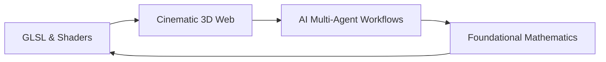

<div align="center">
  
</div>

<div align="center">
  
</div>

<br>

<p align="center">
  
  
</p>

---

## 🌌 About Me

> **"I build things that look impossible in a browser."**

I'm a creative developer specializing in cinematic 3D web experiences — scroll-driven camera narratives, real-time GLSL shaders, and atmospheric scenes that blur the line between game engine and website. I also build AI-powered developer tooling and multi-agent coding workflows.

```yaml
Identity      : void (Vineet Kumar)
Specialty     : Cinematic 3D web · GLSL shaders · Scroll-driven animation
Core Stack    : Three.js · React Three Fiber · GSAP ScrollTrigger · GLSL · Vite
AI Workflows  : Multi-agent orchestration with Claude · Gemini Flash · GPT
Also Build    : Browser extensions · Desktop apps · Automation tools
Location      : Usually behind a screen
```

### 🎯 What I Do
- 🎬 **Cinematic 3D Web** – Scroll-driven camera splines, atmospheric scenes, real-time shader systems
- ⚡ **GLSL Shaders** – Custom ShaderMaterial, fresnel effects, FBM noise, procedural terrain generation
- 🤖 **AI Coding Workflows** – Multi-agent orchestration with structured AGENTS.md systems and round-based task queues
- 🔧 **Developer Tooling** – Browser extensions, PyQt6 desktop apps, CLI automation scripts

---

## 🛠️ Tech Stack

<div align="center">

### 3D / Graphics


### Languages & Frontend


### AI & Agents


### Tools & Platforms


</div>

---

## 🎯 Featured Projects

### ⚡ Universal Shader Studio
**Browser-Based GLSL Editor | React + Three.js**

> Write shaders. See them live. Export anywhere.

[](https://shader-studio-teal.vercel.app)

A real-time GLSL shader editor built for 3D developers who want a fast creative sandbox without leaving the browser. Write vertex + fragment shaders against procedural terrain, primitives, or your own `.glb` models — then export production-ready code in four formats. No setup. No backend.

**Key Features:**
- 🏔️ **Procedural Terrain** – Perlin & Island noise with adjustable resolution, height scale, octaves, and frequency
- 📦 **GLB Drag-Drop** – Drag any `.glb` model into the scene — auto-centered, auto-scaled, geometry merged
- ⚡ **Live GLSL Editor** – Vertex + fragment shader editing with syntax highlighting and built-in shader presets
- 📤 **Multi-Format Export** – Three.js ShaderMaterial · R3F Component · Raw GLSL · Vanilla WebGL boilerplate
- 🌈 **Terrain Color Presets** – Grassland, Rocky Mountain, Desert, Neon Cyber, Mars Red

<p>
  <a href="https://shader-studio-teal.vercel.app"></a>
  <a href="https://github.com/void032/shader-studio"></a>
</p>

**Tech Stack:** `Three.js r168` `React 18` `TypeScript` `GLSL` `Vite 7` `Tailwind` `shadcn/ui` `GLTFLoader` `Perlin Noise`

---

### 🎬 J3DP — Cinematic 3D Portfolio
**Scroll-Driven Camera Narrative | Vanilla JS + Three.js**

A cinematic portfolio site built around a camera traveling a spline path through six atmospheric 3D scenes — each with its own lighting, fog density, and material identity. The camera is the storyteller.

**Architecture Highlights:**
- 🌌 **Sky System** – Custom ShaderMaterial on an inverted sphere; no skybox, full shader control
- ☁️ **Cloud Clusters** – Sphere-cluster system with fresnel-based edge transparency
- 🏔️ **Mountain Layer** – `mountain.glb` with scene textures + flat ShaderMaterial depth planes for parallax
- 💨 **Scene Transitions** – Fog/smoke effects timed to scroll position
- 🔒 **Hard Constraints** – No React, no OrbitControls, no EffectComposer, zero heap allocations in the RAF loop

**Tech Stack:** `Three.js r160` `GSAP ScrollTrigger` `GLSL ShaderMaterial` `Vite` `Anime.js`

---

### 🌍 The Wanderer — Open World R3F
**Instanced Open-World Portfolio | React Three Fiber**

A substantial open-world R3F portfolio featuring a fully walkable environment with custom LOD and manual GPU resource management — optimized from 1M+ triangles at unplayable framerates down to 30–40k at smooth performance.

**Key Features:**
- 🌿 **Grass System** – `MeshSurfaceSampler` placement with vertex-paint masking; procedural shader grass
- 🎯 **Custom LOD** – Concentric instanced zones for geometry density control
- 🔥 **FBM Flame Shaders** – Billboard-based campfire flame using fractional Brownian motion
- 🎮 **Character Controller** – Full animation state machine with locomotion blending
- 📦 **GPU Management** – Manual disposal, texture compression, geometry merging throughout

**Tech Stack:** `React Three Fiber` `Three.js` `GLSL` `Instanced Meshes` `Custom LOD` `Texture Compression`

---

### 🔧 Other Tools

| Project | Stack | Description |
|---|---|---|
| 🎬 **SplitKit** | `Python · PyQt6 · FFmpeg` | Desktop video auto-splitter — dual processing modes (lossless + re-encode), bundled FFmpeg, auto-updater |
| 🖼️ **Image Downloader Pro** | `JavaScript · Chrome APIs` | Bulk image downloader — captures `` tags, CSS backgrounds, and lazy-loaded content |
| 🤖 **AI Workflow Extension** | `JavaScript · Chrome APIs` | Token tracking, prompt optimizer, downloadable skill files for compressed AI replies |
| 🐍 **Python Image Scraper** | `Python · Selenium` | Headless scraper using Chrome profile passthrough — auth-aware, lazy-load support, auto-dedup |

---

## 📊 GitHub Analytics

<div align="center">
  
  
</div>

<div align="center">
  
</div>

<div align="center">
  
</div>

---

## 🔭 Currently Exploring


```mermaid
graph LR
    A[GLSL & Shaders] --> B[Cinematic 3D Web]
    B --> C[AI Multi-Agent Workflows]
    C --> D[Foundational Mathematics]
    D --> A
```

- 🎬 **J3DP** – Scroll-driven cinematic 3D portfolio (Vanilla JS + Three.js r160)
- 🖼️ **Parallax Narrative** – Layered 2D/semi-3D assets with GSAP ScrollTrigger for a "final departure" scene
- 🤖 **Multi-Agent Systems** – Structured AGENTS.md workflows; Gemini Flash as primary Three.js implementation agent
- 📐 **Foundational Mathematics** – Self-studying from the ground up for deeper graphics programming

---

## 🤝 Let's Connect

<div align="center">

[](https://www.linkedin.com/in/vineet-kumar-2ab15217b)
[](https://github.com/void032)
[](mailto:vineetkumar1639@gmail.com)

</div>

---

<div align="center">
  
</div>

<p align="center">
  <i>💡 "The best 3D web experience is the one that makes people forget they're in a browser."</i>
</p>
